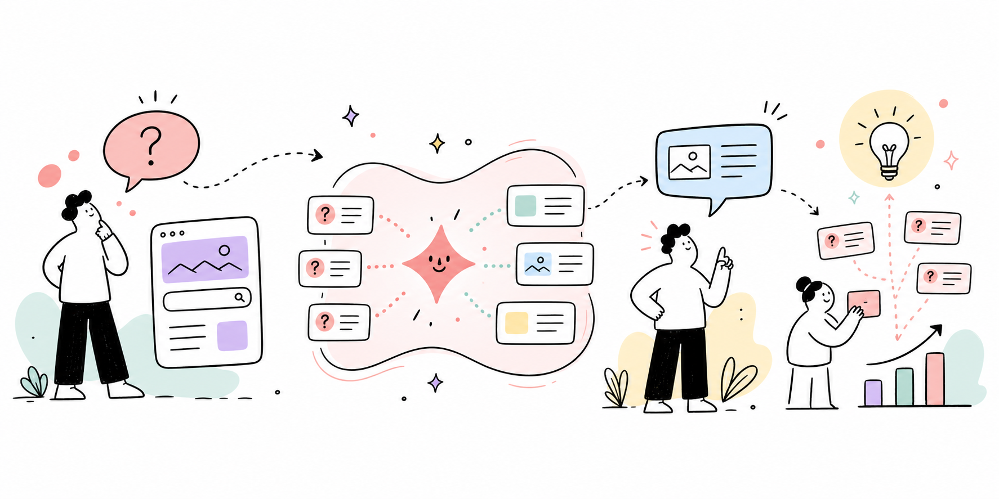

# Liora



Liora is a ProcessWire AI answer CTA and visitor-demand analytics module for
LQRS. It helps a visitor when a search or page does not answer their question,
then records the question so editors can improve the underlying site content.

Squad owns provider credentials and transport. Liora adds:

- a reusable `InputfieldLiora` and frontend widget;
- selectable active provider/model settings;
- configurable prompt, token, timeout, cache, rate-limit and CTA settings;
- conversation threads with chronological visitor and Liora messages;
- optional real-time streamed answers through Squad;
- browser-only conversation history that visitors explicitly restore;
- privacy-conscious demand tracking without raw IP addresses;
- optional country and city enrichment when the GeoIP module is installed;
- configurable welcome copy for an otherwise empty conversation;
- optional lexical-first, semantic-fallback answers from a selected Atlas collection;
- an editable, friendly quality-review notice below the widget;
- native ProcessWire multi-language widget text with ready-made language presets;
- a **Setup → Liora Insights** review dashboard;
- permission-controlled deletion of individual stored messages from Liora Insights;
- import of the legacy `ai` ProFields Table history.

## Template API

Liora can be integrated in four ways:

| Mode | UI included | Creates Insights Threads | Use when |
| --- | --- | --- | --- |
| `renderWidget()` | Yes | Yes | A page needs the complete ready-made conversation experience |
| `InputfieldLiora` | Yes | Yes | A ProcessWire form should own the widget placement |
| JSON endpoint | No | Yes | A custom frontend should retain context, Atlas sources and analytics |
| `ask()` / `chat()` / `complete()` | No | No | Server-side code needs an AI result without a visitor chat |

The **Allow the ready-made Liora chat widget to render** setting controls
`renderWidget()` and `InputfieldLiora` only. It does not disable Liora Insights
or the PHP service API. Enabling it does not inject anything automatically; the
template still decides where the widget appears.

```php
$liora = $modules->get('Liora');

echo $liora->renderWidget([
    'originalQuery' => $searchQuery,
    'context' => $page->template->name,
    'pageId' => $page->id,
]);
```

The JSON endpoint template only needs:

```php
$modules->get('Liora')->handleEndpoint();
```

Direct application calls remain available:

```php
$result = $liora->ask('Suggest a food pairing.');
$text = $liora->complete('Explain the difference between Cognac and Armagnac.');
```

Direct PHP calls do not create a visitor Thread. Use the JSON endpoint when a
custom interface should preserve the conversation, page attribution, GeoIP
metadata, Atlas sources and Insights analytics.

See [docs/INTEGRATION.md](docs/INTEGRATION.md) for complete, copy-ready
examples, including `InputfieldLiora` and a custom frontend without the
ready-made widget.

Never store provider credentials in Liora. Configure them in Squad.

Enable **Keep visitors on this website** to append an editable stay-on-site
instruction to the system prompt. Liora then avoids recommending external
websites, retailers, marketplaces and off-site services. As a deterministic
backstop, external absolute URLs and Markdown links are filtered from completed
answers while same-site URLs and verified Atlas sources remain available.
Provider deltas remain escaped and external links are never made clickable
while streaming. The completed server-filtered answer replaces the draft.

Superusers can delete individual messages in **Setup → Liora Insights**.
Non-superusers need both `liora-review` to open the dashboard and
`liora-delete` to see and use the delete action. Deletion is a server-side,
permanent operation protected by ProcessWire CSRF validation.
The same permission also allows deleting a complete Thread; its messages are
removed with it through the database foreign-key cascade.

Liora Insights paginates Threads and presents each one as a chronological
conversation timeline. Threads start collapsed; the Open/Hide control remembers
the expanded conversations and scroll position for each filter and page in the
current admin browser.
The active provider/model and the settings button remain in a footer toolbar.
When Squad has no usable provider/model, the dashboard displays a prominent
configuration warning instead of silently showing an empty model value.

## Localization

Every visitor-facing widget text uses ProcessWire's native multi-language
configuration fields. Liora reads the active visitor language and falls back
to the default-language value when a translation is empty.

In **Modules → Liora → Widget texts and localization**, a language preset can
fill all text fields at once. Presets are included for English, German, French,
Spanish, Italian, Dutch, Polish and Russian. On a multi-language ProcessWire
site, choose the target language before applying a preset and then submit the
module configuration. The default AI prompt also asks the model to answer in
the visitor's language.

## Optional Atlas retrieval

Enable **Atlas knowledge** in the module settings after Atlas has a populated
collection (the default name is `site`). Liora retrieves a small set of relevant
public-page excerpts, labels them as untrusted reference material and sends them
to the selected Squad model with the visitor's question. Exact source links are
shown below the answer.

The default fast-retrieval option checks significant local terms first, usually
in well under a second, and falls back to semantic embeddings when those
matches are insufficient. Atlas performs retrieval; Squad still generates the answer. If Atlas is missing,
not ready, empty or returns no sufficiently relevant excerpt, Liora continues
with the regular non-RAG answer. Retrieved entries linked to ProcessWire pages
are re-resolved and excluded unless the current page is public.
Entries without a ProcessWire page ID must carry explicit `public: true`
metadata before Liora will use them.

## Conversation model

The server stores one row per conversation in `liora_threads` and chronological
messages in `liora_messages`. The public thread ID is accepted only for the
current hashed ProcessWire session (or authenticated user), so a LocalStorage
copy can safely seed a new server-side conversation after a session expires.

Local history is not loaded into the widget automatically. The visitor uses
**Previous conversations** to choose a browser-stored thread. It can be disabled
and its retention limit can be configured in the Liora module settings.

Conversation labels come from the first visitor question, shortened at a word
boundary. They do not reuse the shared source-page title or require a second AI
provider request. Older LocalStorage labels are updated when history opens.
Visitors can rename a conversation inline from the history list. The browser
copy is saved immediately and the server Thread is updated when the current
session or authenticated user still owns it.

An optional welcome message appears only before the first question. It is not
added to the conversation, stored in LocalStorage or sent to the AI.

Long answers keep their beginning in view while provider deltas arrive. The
conversation grows until its responsive height limit; **Expand conversation**
removes the inner scrollbar when the visitor wants to read the complete thread.

When Squad supports the selected provider, Liora sends newline-delimited JSON
and renders provider deltas as they arrive. Disabling streaming keeps the
regular JSON response flow.

While the provider is preparing its first delta, the conversation shows a
localized animated **Liora is thinking** message without changing the submit
button label. Widget settings independently control message copy actions,
response-time metadata and provider-reported token usage. Completed-answer
metadata is kept with the browser conversation so it remains available after
the visitor restores that Thread.

Assistant answers use a small, escaped Markdown renderer for headings,
paragraphs, ordered and unordered lists, inline/code blocks, bold text and
numbered Atlas citations. Raw model HTML is never trusted. Visitor messages use
compact content-sized bubbles rather than expanding to the full answer width.

## Widget themes

Widget behavior lives in `assets/liora.js`, base layout lives in
`assets/liora.css`, and visual tokens live in `themes/*.json`. Select the active
theme in the Liora module settings or pass `theme` to `renderWidget()`.

The default **LQRS Adaptive (system)** theme contains both `variables` and
`darkVariables`. It follows `prefers-color-scheme` and responds immediately
when the visitor changes the operating-system appearance. **LQRS Light** and
**LQRS Dark** remain available when the surrounding website deliberately
forces one scheme.

Theme JSON can set the allowlisted colors, radius, shadow, message width and
responsive conversation height. Liora reads the file server-side and emits
scoped, validated CSS custom properties, so the browser does not need another
request.
